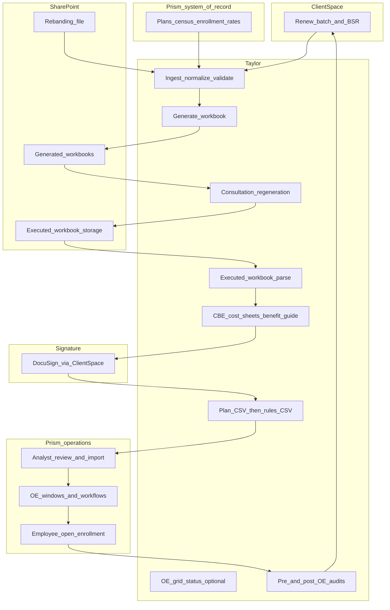

# Renewal end-to-end flow (Taylor v1)

| Field | Value |
| --- | --- |
| **Purpose** | Single numbered, plain-English description of the Questco renewal journey and what **Taylor** automates versus what **Questco** (operations, agency, analysts, reps) still owns. Use this to sanity-check ticket coverage; it does not replace the [PRD](./Taylor-v1-Open-Enrollment-Orchestration-PRD.md) or the SOW. |
| **Sources** | [Taylor v1 PRD v1.5](./Taylor-v1-Open-Enrollment-Orchestration-PRD.md) (primary); [SOW PDF](../contracts/LaunchPad_Taylor_v1_MSA_SOW_signed.pdf); ticket index [README](../tickets/taylor-v1-open-enrollment/README.md); February 2026 workflow transcript [GMT20260223](../meetings/GMT20260223-170806_Recording.transcript.vtt) (legacy “16 steps”). **April 2026 discovery** in the PRD supersedes February where they conflict. |

---

## Audience and how to use this doc

- **Operations and product** can follow the numbered steps to see handoffs, checkpoints, and exceptions.
- **Engineering** can map steps to SOW §2 tickets under [`docs/tickets/taylor-v1-open-enrollment/`](../tickets/taylor-v1-open-enrollment/README.md) using the traceability notes after each step.
- **Contractual scope** remains the SOW; this document is a readable orchestration view.

---

## Scope boundary (what Taylor is and is not)

- **Taylor** is a workbook-centric **orchestration layer**: ingest authoritative data from **Prism**, validate, generate and store workbooks and downstream artifacts, prepare **reviewable** Prism import files, tie into **ClientSpace** workflows and **SharePoint**, and support audits with human checkpoints. It does **not** replace core Excel workbook formulas, become a full data warehouse, or parse OMQ PDFs in v1 (see PRD §9).
- **Questco** owns benefit strategy, client consultation, agency OMQ shopping, manual template keying, analyst review before Prism production imports, DocuSign send timing (human-preferred), templates, mappings, and production integrations credentials (PRD §10).

---

## High-level diagram

---

## Legacy February 2026 walkthrough vs April 2026 PRD

LaunchPad walked through roughly **sixteen** conceptual stages in [GMT20260223](../meetings/GMT20260223-170806_Recording.transcript.vtt) (plan data in Prism → ingest → validate → build workbook → SharePoint link in ClientSpace → consultation → executed workbook trigger → document generation → ClientSpace/DocuSign → Prism import file → import monitoring → pre-OE reconciliation → employee OE in Prism → post-enrollment audit → closeout).

**Superseded or refined by April 2026 (PRD v1.5):**

| Legacy assumption | April 2026 position |
| --- | --- |
| Single “Prism import file” after signing | **Two** CSV imports in order: **client plan** (plan setup) then **benefit rules**; full rules header required. |
| Import workflow wording in SOW | **Open Enrollment grid** in Prism (windows, workflow dropdowns, dates) is **orthogonal** to CSV uploads; may be manual, bulk import, or future automation—not the same as “invoke import.” |
| DocuSign packaging TBD | Prefer **separate attachments** (CBE, cost sheets, **benefit guide(s)**) in one envelope; **human send** after client coordination; reps may **remove** redundant class guides before send (**April 14**). |
| One benefit guide for all classes | **April 14:** Prefer **one benefit guide per benefit class** (labeled); when identical across classes, reps may send **one**—often by **dropping** extras in DocuSign. |
| Workbook macro final step manual | **Backend rewrite** of setup macro logic; eliminate reliance on client-run macros for outputs where possible. |
| Batch/ClientSpace-only triggers | Generation/regeneration triggers **not** only ClientSpace; may include admin/Taylor UI, scheduled batch, M365 automation. |
| Start at “ingest” | Renewals **start from ClientSpace benefit batch** and **BSR**; then Prism pull replaces OBP-style push where implemented. |

---

## Numbered flow

### Step 1 — Benefit batch and BSR (ClientSpace)

Questco starts from the **existing ClientSpace benefit batch** (year-over-year batches; typically **one active batch per client** that Taylor renews). Users open **Benefit Setup & Renewal (BSR)**; a **new BSR** is created and linked to the renewed batch, carrying broker type, renewal type, and related metadata.

- **Taylor:** Later reads/writes status and links (e.g., SharePoint URLs) via ClientSpace integration; does not replace BSR business process.
- **Traceability:** PRD §5.1–5.2; SOW integration/orchestration themes; tickets [2.2.2](../tickets/taylor-v1-open-enrollment/2.2.2-ClientSpace-API-integration-and-workflow-status-updates.md), [2.3.1](../tickets/taylor-v1-open-enrollment/2.3.1-Renewal-state-machine-with-defined-milestones-and-transitions.md).

---

### Step 2 — Authoritative data in Prism (prerequisite)

Plan, census, enrollment, and related **controls** are expected to exist in **PrismHR** (system of record). Rate data follows Questco’s operational calendar (e.g., January 1 mass renewals vs monthly client-sponsored renewals).

- **Taylor:** Does not load raw carrier data into Prism from scratch in this step; may **read** Prism for generation and for round-tripping fields required on import files.
- **Traceability:** PRD §4.1, §5.3; [2.2.1](../tickets/taylor-v1-open-enrollment/2.2.1-Prism-HR-API-Setup-authentication-connectivity-normalization.md), [2.2.5](../tickets/taylor-v1-open-enrollment/2.2.5-Adapter-mapping-layer-to-manage-Prism-schema-dependencies.md).

---

### Step 3 — Ingest from Prism (replace OBP-style push)

**Taylor** pulls client, plan, census, and enrollment via **Prism API**, normalizes it, and stages it for workbook generation—**replacing** the prior “push Prism into ClientSpace” dependency for this path where implemented.

- **Questco:** Keeps Prism accurate; resolves upstream data issues.
- **Traceability:** PRD §5.3; SOW §2.4.1; [2.4.1](../tickets/taylor-v1-open-enrollment/2.4.1-Automated-ingestion-of-client-plan-census-enrollment-data-from-prism-and-rate-data-from-admin-console-upload.md), [2.4.3](../tickets/taylor-v1-open-enrollment/2.4.3-Data-normalization-prior-to-workbook-population.md).

---

### Step 4 — Rates, future rates, and rate band assignment

**Business rules:** Questco master / in-network carrier plans use **one rate band per client** across those plans; **OMQ** plans use **quote-specific** rates, not the global master band.

- **Future rates:** Intended to live in Prism (import path Kelly/Kim → LaWanda with agreed columns). **Rebanding file** (all clients) in **SharePoint** supplies **band assignment** because band label is not a reliable automation field in Prism; late band changes imply **rerun that client**; runs should be **idempotent**.
- **Fallback:** Admin console rate-book upload per SOW where Prism/upload hybrid requires it.
- **Taylor:** Ingest rebanding + read Prism rate state; validate plans, plan groups, and band designation before generation.
- **Traceability:** PRD §5.4, §8; [2.4.2](../tickets/taylor-v1-open-enrollment/2.4.2-Pre-generation-validation-of-plans-plan-groups-and-rate-band-designation.md), [2.5.3](../tickets/taylor-v1-open-enrollment/2.5.3-Rate-book-management.md), [2.2.3](../tickets/taylor-v1-open-enrollment/2.2.3-SharePoint-file-storage-configuration.md).

---

### Step 5 — Pre-generation validation

Run automated checks (zip/state/plan maps, deny lists, pairing rules, etc.—per product/architecture) so bad data fails **before** expensive workbook generation.

- **Taylor:** Validation engine + operator visibility for failures.
- **Traceability:** PRD §5.4–5.5; [2.4.2](../tickets/taylor-v1-open-enrollment/2.4.2-Pre-generation-validation-of-plans-plan-groups-and-rate-band-designation.md), [2.3.3](../tickets/taylor-v1-open-enrollment/2.3.3-Error-handling-retries-and-exception-management.md).

---

### Step 6 — Generate renewal workbook

**Taylor** generates the Excel workbook from Questco templates: populate sheets, run **backend macro-equivalent** logic (hide/rename/cleanup), apply **programmatic protection**, recalc as needed. Support **scheduled/overnight batch**, **on-demand single client**, and **parallel** runs with isolation per client.

- **Questco:** Supplies production templates; defines business rules that templates encode.
- **Taylor:** Posts workbook to **SharePoint** and writes the **URL back to ClientSpace**.
- **Traceability:** PRD §5.5; SOW §2.6.x; [2.6.1](../tickets/taylor-v1-open-enrollment/2.6.1-Generate-renewal-workbooks-using-Questco-templates.md) through [2.6.5](../tickets/taylor-v1-open-enrollment/2.6.5-SharePoint-storage-and-posting-URL-to-ClientSpace.md), [2.6.8.1](../tickets/taylor-v1-open-enrollment/2.6.8.1-Scheduled-batch-generation-including-overnight-runs.md), [2.6.8.2](../tickets/taylor-v1-open-enrollment/2.6.8.2-Parallel-generation-of-one-some-or-all-client-workboos.md).

---

### Step 7 — Consultation (human)

Rep and client review the workbook; changes may require **regeneration**. **Taylor** is lightly involved—orchestration and status—not the consultation conversation.

- **Traceability:** PRD §5.6; [2.3.1](../tickets/taylor-v1-open-enrollment/2.3.1-Renewal-state-machine-with-defined-milestones-and-transitions.md).

---

### Step 8 — Open market quotes (OMQ) optional branch

Agency owns shopping and narrowing quotes; **temps** key structured **Questco templates**; Taylor **injects** OMQ rows into the workbook for side-by-side comparison and **regenerates** when OMQ data arrives. **No PDF parsing in v1.** BSR OMQ fields are **tracking**, not structured quote storage. Age-banded quotes may be **partial** in the workbook.

- **Taylor:** Optional admin capture of OMQ data; injection + validation consistent with Prism-oriented flows.
- **Traceability:** PRD §5.7; SOW §2.10; tickets [2.5.4](../tickets/taylor-v1-open-enrollment/2.5.4-OMQ-plan-data-entry-and-management.md), [2.10.2.1](../tickets/taylor-v1-open-enrollment/2.10.2.1-Injection-of-OMQ-plans-into-renewal-workbook-alongside-Prism-sourced-plans.md), [2.10.3.x](../tickets/taylor-v1-open-enrollment/2.10.3.1-Inclusion-of-selected-OMQ-plans-in-generated-Prism-import-files.md).

---

### Step 9 — Executed workbook intake

**“Executed”** means elections and contributions are complete: **column L** elections, **column N** explicit contribution method (not placeholder text), **O/P** and **L–R** band for medical/dental/vision as applicable, plus **employer-paid** blocks completed—aligned with **Baby Taylor** kick-backs.

- **Trigger (architecture TBD):** SharePoint file event, **global ingest folder** with client ID in workbook, or **ClientSpace → HTTP** to Taylor. **Taylor** should write the **SharePoint URL** of the executed workbook to ClientSpace so reps do not double-maintain links.
- **Taylor:** Parse, normalize, **server-side validate** submitted workbook data.
- **Traceability:** PRD §5.8; [2.3.4](../tickets/taylor-v1-open-enrollment/2.3.4-Submission-process-for-completed-workbook-ingestion.md), [2.6.6](../tickets/taylor-v1-open-enrollment/2.6.6-Workbook-completion-trigger-automation.md), [2.6.7](../tickets/taylor-v1-open-enrollment/2.6.7-Retrieval-parsing-normalization-and-validation-of-executed-workbooks.md), [2.4.4](../tickets/taylor-v1-open-enrollment/2.4.4-Server-side-validation-of-submitted-workbook-data.md).

---

### Step 10 — Client-facing documents (CBE, cost sheets, benefit guide)

From the executed workbook, **Taylor** generates:

- **CBE** — renewal plan rows ordered **cheapest to most expensive** within groups where possible; voluntary block from workbook; optional **notes** captured in workbook and synced to ClientSpace; annual disclosure pages updated yearly.
- **Cost sheets** — **one per benefit class**; employee-paid costs; **column Q** monthly with pay frequency from Prism/client master → per-pay display.
- **Benefit guide** — conditional pages from selections; static **PDF** library in **SharePoint** with annual updates; dynamic **medical/dental/vision** side-by-sides (up to three plans per page, paginate); dynamic **table of contents**; **one guide per benefit class** with **class label** (reps may omit duplicate attachments in DocuSign when a **single** guide applies to everyone); carrier-supplied PDF inserts may still be **manual** (compliance). **April 14** transcript: [BenefitGuideDiscovery-4.14.26.md](../meetings/BenefitGuideDiscovery-4.14.26.md).

**Packaging:** Deliver **together** for review and signing; **separate DocuSign attachments** (not one sloppy merge or zip). **Human send** of DocuSign preferred after coordination.

- **Non-renewal:** If client terminates benefits, **no** executed workbook path—separate ClientSpace workflow.

- **Traceability:** PRD §5.8; SOW §2.7.1; [2.7.1.1](../tickets/taylor-v1-open-enrollment/2.7.1.1-Automated-generation-of-the-Client-Benefit-Elections-CBE.md)–[2.7.1.4](../tickets/taylor-v1-open-enrollment/2.7.1.4-Automated-generation-of-the-combined-packed.md), [2.7.2](../tickets/taylor-v1-open-enrollment/2.7.2-DocuSign-Workflow-via-ClientSpace.md), [2.7.3](../tickets/taylor-v1-open-enrollment/2.7.3-Signature-tracking-and-automated-workflow-transitions.md).

---

### Step 11 — Signature complete (handoff to imports)

When signing completes, **Taylor** tracks status (polling or integration) and advances orchestration per **renewal state machine** rules.

- **Traceability:** [2.3.5](../tickets/taylor-v1-open-enrollment/2.3.5-Automated-state-transitions-tied-to-signature-import-and-audit-events.md), [2.7.3](../tickets/taylor-v1-open-enrollment/2.7.3-Signature-tracking-and-automated-workflow-transitions.md).

---

### Step 12 — Prism import file generation (two steps, not one)

**Taylor** produces **two CSV artifacts** for analyst review:

1. **Client plan** (plan setup) — **first**.
2. **Benefit rules** (~82 columns, full header row) — **second**; rules cannot attach without plans.

Imports may require **Prism API round-trip** to populate fields that must not be blank (Prism overwrites blanks on import). **Multi-company ID** rows possible for affiliated entities.

- **Change policy:** If client-visible data is wrong, **fix workbook and regenerate**; raw import-only edits reserved for process bugs or non–client-visible fixes (with rare exceptions per operations).

- **Traceability:** PRD §5.9; SOW §2.8.1; [2.8.1](../tickets/taylor-v1-open-enrollment/2.8.1-Generate-plan-setup-and-contribution-import-files.md), [2.8.3](../tickets/taylor-v1-open-enrollment/2.8.3-Manual-review-checkpoint-prior-to-Prism-submission.md).

---

### Step 13 — Manual analyst review (mandatory before production import)

Analysts open files from **SharePoint** links surfaced on **ClientSpace tasks**; they may hand-edit edge cases (e.g., waiting period after sign-off). v1 favors **CSV + human review** over blind API writes.

- **Traceability:** PRD §5.9; [2.8.3](../tickets/taylor-v1-open-enrollment/2.8.3-Manual-review-checkpoint-prior-to-Prism-submission.md).

---

### Step 14 — Prism production import (operator/analyst)

Analysts run **separate** Prism import actions (plan, then rules). **Taylor** does not silently auto-submit to production Prism without agreed controls.

- **Traceability:** PRD §5.9; [2.8.1](../tickets/taylor-v1-open-enrollment/2.8.1-Generate-plan-setup-and-contribution-import-files.md).

---

### Step 15 — Open Enrollment grid / workflow windows (separate from CSV)

In Prism, configure **open enrollment windows**, **workflow** selection (medical-only, full OE, ancillary-only, client-specific such as **NBS**), and **dates** so employees receive the correct enrollment experience. This is **not** satisfied by uploading plan/rules CSVs alone; may be manual, **bulk grid import**, or future automation.

- **Taylor:** May surface whether clients have OE windows configured so none are “left behind” (admin console visibility—see open decisions).
- **Traceability:** PRD §5.9, §8; [2.8.2](../tickets/taylor-v1-open-enrollment/2.8.2-Generate-Open-Enrollment-workflow-to-invoke-import.md), [2.3.6](../tickets/taylor-v1-open-enrollment/2.3.6-Admin-console-providing-renewal-status-visibility-and-light-reporting.md).

---

### Step 16 — Employee open enrollment (Prism)

Employees enroll **in Prism**; **Taylor** is not in the employee enrollment UX path.

- **Traceability:** Implied PRD §5.9; February transcript “open enrollment” step.

---

### Step 17 — Pre-enrollment and post-enrollment audits

**Pre-enrollment:** Reconcile billing/contributions, CBE vs Prism, workbook/rates vs Prism (less reliance on stale ClientSpace when Prism is authoritative). **Post-enrollment:** HSA, orphan, mismatch, discrepancy checks; **exceptions** routed to **ClientSpace**; full underwriting remains in separate systems; Taylor may **flag** census deltas.

- **Traceability:** PRD §5.10; SOW §2.9; [2.9.1.x](../tickets/taylor-v1-open-enrollment/2.9.1.1-Billing-and-contribution-reconciliation.md), [2.9.2.x](../tickets/taylor-v1-open-enrollment/2.9.2.1-HSA-Audit.md), [2.5.5](../tickets/taylor-v1-open-enrollment/2.5.5-Audit-result-review-and-exception-monitoring.md).

---

### Step 18 — Visibility, reporting, and closeout

Operators see renewal pipeline status, errors, and light reporting (exact split between **Taylor admin console** and **Q Insights** is a **decision gate**—PRD §8). Batch/workflow reaches a controlled **complete** state when milestones and exceptions are resolved.

- **Traceability:** PRD §2, §8; [2.3.6](../tickets/taylor-v1-open-enrollment/2.3.6-Admin-console-providing-renewal-status-visibility-and-light-reporting.md), [2.5.2](../tickets/taylor-v1-open-enrollment/2.5.2-Renewal-status-dashboard.md), [2.5.6](../tickets/taylor-v1-open-enrollment/2.5.6-Renewal-pipeline-reporting-and-workbook-generation-activity-summaries.md), [2.3.2](../tickets/taylor-v1-open-enrollment/2.3.2-Structured-logging-and-audit-trail-of-system-events.md).

---

## What Taylor (LaunchPad) builds vs what Questco supplies

| Area | Taylor (LaunchPad) | Questco |
| --- | --- | --- |
| **Orchestration & integrations** | Azure app, Prism/ClientSpace/SharePoint integrations, state machine, logging, admin console foundation | Timely decisions, UAT, operational ownership |
| **Workbook & documents** | Generation from Questco templates, macro-equivalent backend, protection, executed parsing, CBE/cost sheet/benefit guide generation | Production workbook, CBE, cost sheet, benefit guide, Prism import **templates**; column-by-column mapping workbook ↔ Prism; benefit guide page inventory |
| **Data** | Ingest, normalize, validate; optional rate-book upload UI | Authoritative Prism data, rebanding file stewardship, test clients, API/sandbox access |
| **Compliance & send** | DocuSign integration **via ClientSpace**, signature tracking | **Human** DocuSign send preference; legal wording on combined materials |
| **Imports** | Generate **reviewable** CSVs; analyst workflow hooks | Analyst review, production Prism import execution, OE grid configuration judgment |
| **Audits** | Automate checks, surface exceptions, ClientSpace tasks | Resolve exceptions, underwriting outside Taylor |

---

## Open decisions that affect the flow

See PRD **§8** (rates calendar, Q Insights vs admin reporting, OMQ template split, executed-workbook trigger finalization, Prism column mapping workbook gaps, OE grid automation level, non-broker benefit guide liability, etc.).

---

## Document control

| Version | Notes |
| --- | --- |
| **1.0** | Initial numbered flow from PRD v1.4, SOW/ticket traceability, February transcript reconciliation, single overview diagram. |
| **1.1** | Step 10 and superseded table updated for **PRD v1.5** / **April 14, 2026** benefit guide discovery (per-class guides, DocuSign thinning). |

When the PRD or SOW changes under change control, update this document to match.
