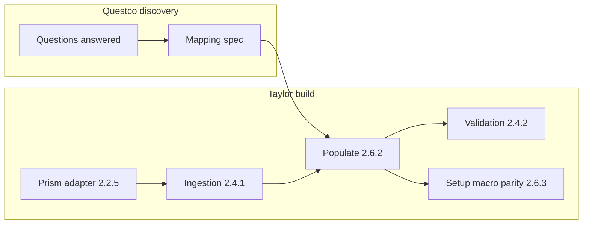

# Renewal workbook — Questco discovery

This document lists **open questions** for the Questco team about the macro-enabled **renewal workbook** (`.xlsm`) so Taylor can populate it from Prism, apply post-processing, and validate outputs. Answers unblock implementation of [2.4.1](../tickets/taylor-v1-open-enrollment/2.4.1-Automated-ingestion-of-client-plan-census-enrollment-data-from-prism-and-rate-data-from-admin-console-upload.md), [2.6.2](../tickets/taylor-v1-open-enrollment/2.6.2-Populate-workbooks-with-Prism-and-rate-book-data.md), and related tickets.

**Companion:** structural description of each sheet is in [Renewal-Workbook-Template-Sheet-Reference.md](../Renewal-Workbook-Template-Sheet-Reference.md).

---

## Ownership and status

Assign an **owner** and **due date** per section. Record answers inline or link to workshop notes.

| Section | Owner | Due | Notes / answer link |
| --- | --- | --- | --- |
| Template governance and versioning | | | |
| “Ready for client” and delivery rules (`CSExport`) | | | |
| Benefit classes and sheet naming | | | |
| Data sources: Prism vs manual vs ClientSpace batch | | | |
| Rates and premiums | | | |
| Census (`Census` sheet) | | | |
| Macros and post-processing | | | |
| OMQ and voluntary content | | | |
| Validation and golden files | | | |

---

## Questions

### Template governance and versioning

- Who **owns** the canonical renewal template (`.xlsm`), and what is the **change-control** process when columns, named ranges, or sheet names change?
- Is there a **version id** (hidden sheet, file property, named cell) Taylor should read/write for audit?
- Which **Excel / Microsoft 365 features** are required (e.g. `XLOOKUP`, dynamic arrays)—what is the **minimum client Excel version**?

### “Ready for client” and delivery rules (`CSExport`)

- What must be true for **`B8 = Yes`** (and thus “READY FOR CLIENT”)? Is this **only** data completeness, or also rep approval?
- Are **Benefit Rep** fields (e.g. `B12`–`B14` in templates analyzed to date) always populated by Taylor/Prism or **manually** before send?

### Benefit classes and sheet naming

- When are class tabs **renamed** (e.g. `PRIMARY`, `OWNERS` vs `Class 1`, `Class 2`)? Is naming **purely cosmetic** or tied to Prism/ClientSpace labels?
- What is the **maximum active classes** in production (always seven slots, or fewer)?

### Data sources: Prism vs manual vs ClientSpace batch

- For **`CurrentPlans`** and **`RenewalPlans`**: which **columns** are expected to be **fully populated from Prism** in v1 vs keyed **manually** (or from OMQ template) after Taylor’s first pass?
- Does generation still assume a **ClientSpace benefit batch** “shell” today, or can Taylor be the **only** upstream for a given client renewal?
- Are **renewal** rows always present in Prism at generation time, or does ops sometimes run “current-only” first?

### Rates and premiums

- Confirm the operating rule: **one rate band per client** across carrier plans—where should Taylor read **premiums** (Prism **future rate band**, current band, or **upload** per [2.5.3](../tickets/taylor-v1-open-enrollment/2.5.3-Rate-book-management.md))?
- If Prism rates are incomplete, what is the **fallback** (block generation vs generate with warnings)?

### Census (`Census` sheet)

- When is **`Census`** included vs omitted? Which **columns** are mandatory for Taylor v1?
- Which fields must match **Prism** exactly (employee id, zip, state, employment type, regional flags)?

### Macros and post-processing

- Provide a **step-by-step list** of what existing **VBA** does today (sheet hide/show, rename, delete unused class tabs, cleanup rows, protection). This feeds [2.6.3](../tickets/taylor-v1-open-enrollment/2.6.3-Backend-rewrite-of-workbook-setup-macro-logic.md): backend parity vs **Excel automation** running macros.
- Are there **external workbook links** in production files—should Taylor strip, preserve, or refresh them?

### OMQ and voluntary content

- What are the exact **injection points** for OMQ plans (which sheets/ranges) relative to Prism-filled rows? See [2.10.2.1](../tickets/taylor-v1-open-enrollment/2.10.2.1-Injection-of-OMQ-plans-into-renewal-workbook-alongside-Prism-sourced-plans.md).
- Are **`Ancillary Plans`** / **`Questco Voluntary`** pages **static** in the template, or ever **data-driven** from Prism or carrier files?

### Validation and golden files

- Can Questco provide **one redacted golden workbook** (input Prism snapshot + expected output) per **major template version** for automated regression?
- What **business checks** must Taylor run before SharePoint handoff (beyond `CSExport` readiness text)?

---

## How answers feed Taylor

---

## Asana alignment

Local tickets in [docs/tickets/taylor-v1-open-enrollment/README.md](../tickets/taylor-v1-open-enrollment/README.md) can be updated independently of Asana. After discovery stabilizes, **paste key bullets** into the matching Asana tasks or wait for the next **CSV export** and regeneration workflow (`taylor_asana_metadata_from_csv.py`, `taylor_tickets_prds.py`) so product can sync descriptions in bulk.
