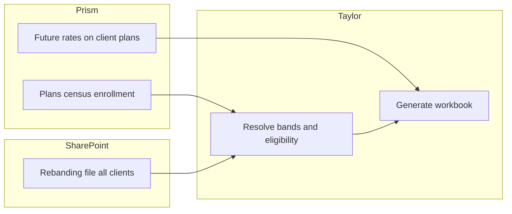
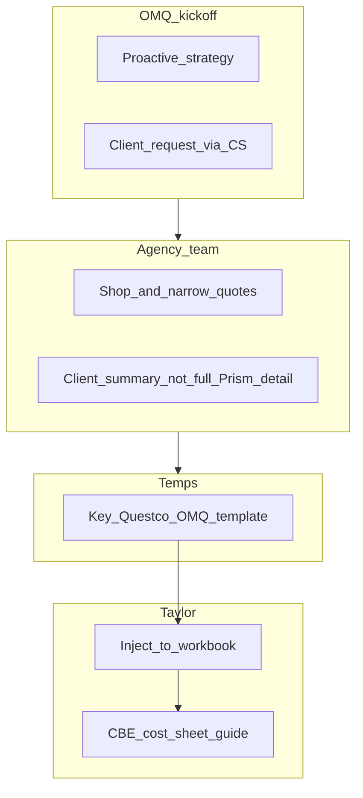

# Product Requirements Document: Taylor v1 — Open Enrollment Orchestration

| Field | Value |
| --- | --- |
| **Version** | 1.3 |
| **Date** | April 9, 2026 |
| **Sources** | SOW: *LaunchPad Lab – Taylor v1 Build – MSA & SOW* (Statement of Work 1); meetings: *Taylor Flow Review/Confirmation – April 7, 2026* ([recording](https://fathom.video/share/4J9apsvNkz-pPdRFxShF4ZpxgBMbGgTy)); *Deep Dive: Workbook – April 8, 2026* ([recording](https://fathom.video/share/NWNNKYC5HZsyyquUZ-zD3ojb1EZ_A4-_)); *Weekly Status – April 8, 2026* ([recording](https://fathom.video/share/Fwev1sti75f5_-WVsTUz42isSgp7hHPw)); *Deep Dive: OMQ – April 9, 2026* ([recording](https://fathom.video/share/A1c3f7uxoXA4TxwiY9uHhGruYARkhotL)) |
| **Product** | Taylor v1 |

This PRD describes what Taylor v1 must do for Questco, how it fits existing renewal operations, and where scope decisions remain open. Contractual scope is defined by the SOW; this document operationalizes that scope with stakeholder workflow inputs from the April 7 session, follow-on discovery April 8, and the **April 9 OMQ deep dive** (agency operations, materials liability, audits).

---

## 1. Vision & problem statement

**Vision:** Taylor v1 is a workbook-centric renewal orchestration layer that automates data ingestion, validation, document generation, audit workflows, and Prism import preparation while **keeping Questco’s macro-enabled Excel workbook as the primary UI** for renewal decisions.

**Problems addressed:**

- Manual creation and synchronization of benefit batches and heavy renewal-season volume (1,500+ January 1 renewals; additional clients renewing monthly).
- **Prism as payroll/benefits source of truth** vs. ClientSpace data drift—today teams push Prism → ClientSpace (e.g., OBP-style flows); Taylor should pull authoritative data from Prism.
- Fragmented document timing: CBE, cost sheets, and benefit guides are produced on different timelines today (including third-party benefit guide turnaround), delaying a unified client package.
- Bottlenecks on DocuSign resends and batch status management.
- Need for controlled automation with **human checkpoints** where operations (e.g., imports) require trust and review.

---

## 2. Goals & success criteria

| Goal | Success criteria (indicative) |
| --- | --- |
| Reduce manual renewal prep | Batch renewal, Prism-sourced population, and workbook generation replace redundant manual ClientSpace ↔ Prism pushes where agreed. |
| Single client-facing package | CBE, cost sheet(s), and benefit guide generated and presented together; signature covers the combined materials per agreed legal/ops wording. |
| Trust but verify | Prism import files generated by Taylor remain **reviewable** before submission; audit trail and reconciliation support post-enrollment checks. |
| Operational visibility | Renewal pipeline status, errors, and light reporting available without duplicating executive reporting unnecessarily (see §8). |
| SOW delivery | Production app, integrations (PrismHR, ClientSpace, SharePoint), orchestration engine, admin console foundation, and documentation per SOW §3. |

---

## 3. Personas & stakeholders

| Role | Needs |
| --- | --- |
| Renewal operations (Anna, Jagger, Dimple, reps) | Clear batch/workbook flow, fewer bottlenecks, DocuSign visibility, one place to see status. |
| Temps / data entry | Structured way to enter open market quote (OMQ) data for v1 (template-driven). |
| Analyst / imports team | Manual review of Prism import files before submission; direct path to artifacts (e.g., SharePoint link from ClientSpace task). |
| Leadership | High-level renewal progress without over-detailed operational dashboards; **avoid merging multiple conflicting reports** where possible. |
| LaunchPad Lab | Stable APIs, templates, test data, and timely decisions on open items (admin console split, rate-book path). |

---

## 4. Product principles (from SOW + workshop)

1. **PrismHR is the system of record** for client, plan, census, and enrollment data (SOW §4.1).
2. **The workbook remains the in-flight contract** for renewal decisions; Taylor does not replace core workbook calculation logic (SOW §4.2–4.3).
3. **Data not in Prism** is sourced from the workbook; Taylor is not a master data warehouse (SOW §4.6).
4. **OMQ carrier proposals**: manual entry only in v1; no automated PDF/carrier parsing (SOW §4.9).
5. **Imports**: Client review and approval before Prism submission (SOW §4.8; reinforced by operations).

---

## 5. End-to-end workflow (April 7 confirmed)

### 5.1 Start: benefit batch renewal

- Renewals **start from the existing ClientSpace benefit batch** (batches exist year-over-year; e.g., 2024 expired, **2025 active**).
- There should be **one active batch per client** that Taylor renews (label + expiration drive which batch is “current”).
- Taylor **renews that batch**, then **pulls current data from Prism** (not ClientSpace) to populate the new batch context—because Prism reflects payroll and year-round changes; ClientSpace may be stale.

### 5.2 Benefit Setup & Renewal (BSR)

- From the batch, users open **BSR**; a **new BSR is created** and **linked to the renewed batch**.
- BSR fields include broker type, renewal type, and related metadata as today.

### 5.3 Replace OBP-style import with Prism API ingestion

- **Today:** OBP import pulls current benefits from Prism into ClientSpace, with dependency on benefit rules and rate groups existing in both systems.
- **Taylor:** Ingest client/plan/census/enrollment from **Prism via API**, normalizing data before workbook generation—**replacing the manual “push Prism into ClientSpace” step** for this path where implemented.

### 5.4 Rate bands & rate books

- **Business rule:** **One rate band per client** applies across **Questco master / in-network carrier plans** for that client (e.g., one band for ~99 Aetna plans). **OMQ plans are out of scope for this rule:** open-market quotes use **carrier- and quote-specific static rates**, not the client’s global master rate band ([§5.7](#57-open-market-quotes-omq); **April 9**).
- **Today:** Rate grids flow through ClientSpace (plan shells, plan setup, rates), then into Prism **future rate band**; at 1/1, Prism promotes future → current.
- **Desired direction:** Populate Prism **future rate band** from Taylor or a **direct Prism import** path so ClientSpace is not required for rate data Questco does not need there. **April 8 alignment:** Dimple confirmed with **LaWanda** the Prism **import file and columns** for **future rates**; **Kelly/Kim** produce rebanding first, then **LaWanda** runs the Prism import of the final file. Leadership (**Chris**) asked Questco to publish **calendar dates** for open enrollment: when all rate data must be loaded into Prism to avoid renewal-season scrambling.
- If Prism can be populated reliably without Taylor UI, Taylor may **read** rate state from Prism for workbook generation rather than owning full rate-book management in the admin console.
- **Band assignment vs. Prism (April 8):** Stakeholders confirmed the **client’s band identifier** is **not stored as a first-class field in Prism**; rates in Prism may reflect the band without exposing the band label for automation. Taylor therefore needs a **rebanding assignment source** outside Prism for “which band is this client in per carrier,” analogous to Baby Taylor ingesting rebanding files today.
- **SharePoint-hosted rebanding file (working approach, April 8):** Store the **rebanding file** (contains **every client**, not only changed bands) in **SharePoint**; Taylor **ingests** it to resolve bands and to support **late band changes** without forcing a Prism import bottleneck. If a band changes after a workbook was generated, operations **rerun that client**; Taylor runs should be **idempotent** (regenerate or skip as needed).
- **Baby Taylor context:** Legacy validation compared ClientSpace output to local rate/rebanding files; if Prism is authoritative and imports are correct, Taylor’s role may shift to **generation + validation from Prism** for **rates**, while **band assignment** still comes from the rebanding ingest unless Prism gains a durable band field later.

**PRD requirement:** Support workbook generation and validation using **authoritative plan data from Prism**, **future rates in Prism** (via agreed import path), and **band assignment** from the **SharePoint rebanding file** unless superseded by a change-controlled decision. Admin console rate-book upload remains a **fallback** per SOW where Prism/upload hybrid requires it.

- **Renewal timing (April 8):** **Client-sponsored (CSP)** renewals use roughly a **90-day** lead time (broker/carrier coordination). **Questco-sponsored / January 1** open enrollment: operations typically **start batches in August** (rates land end of August; client conversations in September; internal summit needs workbooks ready). **Sponsorship flavor** for scheduling rules is indicated by **plan ID naming conventions**; Questco analyst team to provide a key.

### 5.5 Workbook generation & storage

- After Prism-backed data is ready, Taylor **generates the renewal workbook** from Questco templates: populate sheets, run **backend macro-equivalent logic** (sheet hide/rename/cleanup), **programmatic protection** matching current behavior, **validate** against Prism and applicable rate rules.
- Store workbook in **SharePoint** and **post URL back to ClientSpace**.
- Support **scheduled/overnight batch** generation and **on-demand single-client** runs (parallel processing, transaction isolation per SOW).

### 5.6 Consultation

- **Consultation behavior stays materially the same:** rep and client review the workbook; if changes are needed, plans can be adjusted and workbook **regenerated** as needed.

### 5.7 Open Market Quotes (OMQ)

- OMQ is **separate operationally** (agency, underwriting) but should appear **in the same workbook** as Prism-sourced options for a **unified presentation**.
- **v1 (stakeholder preference):** Questco uses a **structured template** (manual keying by temps); Taylor **reads the template** and **injects OMQ plans** into the workbook for side-by-side comparison, then **regenerates** the workbook when OMQ data arrives. Quotes arrive in inconsistent PDF/format from carriers—**no automated parsing in v1** (aligns with SOW §4.9). **April 8:** ClientSpace BSR fields for OMQ are **tracking only** (checkboxes, workflow stage)—**not** structured quote storage; the **template** is the capture surface for Taylor.
- **Operational ownership (April 9):** The **agency** (open-market team) owns shopping and carrier relationships. Kickoff is **either** proactive (strategy before or during renewal when the renewal looks unfavorable) **or** a **client request during renewal** (client service kicks a **shopping task** to agency). Carriers may return **very large** raw proposals; agency **narrows** to a client-facing set before presentation.
- **Quote timing (April 9):** Often **5–10 business days** in fourth quarter for typical small-group flows; longer when Questco is **not yet appointed** with a carrier, or for **large group** (e.g., **10–20+** days with back-and-forth in peak season). Keeping a batch in **consultation** on the order of **~two weeks** while waiting for OMQ is acceptable—no new batch status required (**April 8**).
- **Roles (April 9):** **Temps** key the **Questco OMQ template** for Taylor. The **agency** produces **strategy** and client-facing **summary** views (high-level plan highlights); **Taylor** still needs **full plan detail** aligned to **Prism build/import**, not only the summary the client sees.
- **Template shape (April 9, clarify):** Stakeholders discussed **medical, dental, and vision** as potentially **separate templates**—health dominates OMQ volume (~90%); dental/vision OMQ is rare. **Pending** product decision: one workbook-facing template vs. split templates.
- **Prism alignment:** Sample **Prism import header** file lives in **Asana** (**April 9**); OMQ template fields should align with what analysts key and with generated imports ([§5.9](#59-prism-import-files--manual-checkpoint)).
- **OMQ vs master rate bands (April 9):** Open-market plans do **not** use the client’s **Questco master rate band** the way in-house options do; they carry **quote-specific carrier/market rates**. **Composite vs. age-banded** behavior varies by **state and carrier**, not only by geography.
- **Age-banded and non-static rates (April 8):** Some carrier quotes use **age-banded** or otherwise **non-composite** rate structures (e.g., many age points). Those rates **cannot always be represented fully** in the standard workbook grid; the OMQ template should treat such fields as **optional** or **partial** so Taylor can still inject what is representable without blocking the renewal.
- **SBC / structured capture:** No production system today reads **SBC** documents to auto-build plan rows (**April 9**); aspirational for a later Taylor generation—see [§9](#9-out-of-scope-v1).
- **Batch status during OMQ (April 8):** No new ClientSpace batch status is required for “open market quote requested”; keep the batch in **consultation** while quotes are gathered and the workbook is regenerated.
- **v2:** More automation (“fancy”)—out of v1 scope unless separately agreed.

### 5.8 Executed workbook → documents & signature

- **Trigger:** **Executed workbook** in SharePoint drives generation (stakeholder alignment from session).
- **Generate together:** **CBE**, **cost sheet(s)**, **benefit guide**, and a **logically combined client deliverable** (SOW §2.7.1). **April 9:** Stakeholders want the **three artifacts available together** for signature and review, but **not** a single merged file or **zip** that an employer might forward incorrectly—prefer **separate files** in the DocuSign envelope (same signing event, distinct attachments). Refines “combined packet” to **combined in workflow**, not necessarily one PDF.
- **Cost sheet vs. CBE/benefit guide:** Cost sheet reflects **employee-paid** costs per paycheck; benefit guide communicates **employer-paid** benefits that do not appear on the cost sheet.
- **OMQ and broker-of-record (April 9):** When Questco is **not** the broker for an OMQ plan, operations **avoid Questco-branded materials** that imply Questco liability for that carrier/plan. Today that is handled by **manual** omission, third-party pages, or vendor-inserted medical pages. **Open:** whether Taylor models a **flag**, checklist, or phased automation so **regenerated** documents do not re-introduce excluded content—product/legal follow-up.
- **When Questco is the broker:** Agency may still supply **side-by-side** medical pages for the third-party benefit-guide vendor to **insert**—process nuance alongside Taylor-generated shells.
- **Final rates timing (April 9, open risk):** For some small-group OMQ paths, **final** rates may only settle **after enrollment and carrier audits**—implications for when workbook and downstream materials are “final” need further design (**Anna**, **Betty**).
- **DocuSign:** Routed **via ClientSpace** (SOW §2.7.2). Requirements from workshop:
  - **Human send (April 9):** **Dimple** and **Anna** prefer a **person** to click **Send DocuSign** after coordinating with the client (reduces surprise expirations and supports outreach).
  - **Notify** on expired, declined, or voided envelopes; avoid silent failures.
  - **Reduce bottleneck:** automation so Anna/Jagger are not the only path to **resend** or reset (exact mechanics TBD with ClientSpace capabilities—e.g., **reset/re-send** flow, batch status rules).
  - Preserve **guardrails:** stakeholders still want **controlled status progression** so batches are not left in inconsistent states.

### 5.9 Prism import files & manual checkpoint

- Taylor **generates** plan setup / contribution / open enrollment workflow import artifacts as specified (SOW §2.8).
- **Mandatory manual review** before Prism submission: analyst/imports team must **open and review** files; **ClientSpace task should include a link** to SharePoint location for one-click access.
- **Change management:** involve the analyst in Prism import design **early** (workshop action item).

### 5.10 Audits & reconciliation

- Pre-enrollment and post-enrollment audits (billing/contribution reconciliation, HSA/orphan/mismatch checks, etc.) with **exceptions routed to ClientSpace** where applicable (SOW §2.9).
- **Pre-enrollment (April 9):** Aligns with **Baby Taylor**–style checks: workbook/output vs **rate books** and **rate bands** when Taylor drives from **Prism**—**Prism auditing Prism** for this path; less emphasis on auditing stale **ClientSpace** vs Prism when ClientSpace is not the rate source of truth (**Jagger**, **Anna**).
- **Post-enrollment (April 9):** Full **underwriting** (risk scores, age/gender scoring) remains in Questco’s **underwriting software**; **Taylor** may **flag** census/enrollment deltas for human review. Operations may still run underwriting workflows **for every group** regardless of flags (**Betty**). **Follow-up session** may be needed to finalize post-enrollment audit scope.
- Detailed rules to be refined in technical deep dives; stakeholder expectation: **automation with auditability**, not blind auto-submit.

---

## 6. Functional requirements (SOW §2 = tickets)

**Functional requirements are the SOW Statement of Work 1, Section 2 (*Project Areas of Work*) items, one-to-one.** Each bullet below quotes the SOW numbering and title; the link points to the matching work ticket under [`docs/tickets/taylor-v1-open-enrollment/`](../tickets/taylor-v1-open-enrollment/README.md). Spikes and Sprint 0 items live in the same folder.

Contextual workflow detail (batch renewal, Prism as SoR, OMQ template preference, DocuSign bottlenecks, etc.) stays in **§5** and **§8**; this section is the **contractual checklist** aligned with implementation tracking.

### 2.1 Design & requirements finalization

- **2.1.1** Design, review, and approve technical architecture around Azure infrastructure including Azure resources, integration patterns, data services, identity controls, logging/monitoring, and deployment environments — [ticket](../tickets/taylor-v1-open-enrollment/2.1.1-Review-and-Define-Technical-Architecture.md)
- **2.1.2** Define, review, and approve finalized user stories and technical requirements including implementation details, and acceptance criteria — [ticket](../tickets/taylor-v1-open-enrollment/2.1.2-Align-on-User-Stories-and-Acceptance-Criteria.md)

### 2.2 Integration & infrastructure

- **2.2.1** PrismHR API setup (authentication, connectivity, normalization) — [ticket](../tickets/taylor-v1-open-enrollment/2.2.1-Prism-HR-API-Setup-authentication-connectivity-normalization.md)
- **2.2.2** ClientSpace API integration and workflow status updates — [ticket](../tickets/taylor-v1-open-enrollment/2.2.2-ClientSpace-API-integration-and-workflow-status-updates.md)
- **2.2.3** SharePoint file storage configuration — [ticket](../tickets/taylor-v1-open-enrollment/2.2.3-SharePoint-file-storage-configuration.md)
- **2.2.4** Azure hosting architecture and environment setup — [ticket](../tickets/taylor-v1-open-enrollment/2.2.4-Azure-hosting-architecture-and-environment-setup.md)
- **2.2.5** Adapter/mapping layer to manage Prism schema dependencies — [ticket](../tickets/taylor-v1-open-enrollment/2.2.5-Adapter-mapping-layer-to-manage-Prism-schema-dependencies.md)
- **2.2.6** Client list synchronization with ClientSpace — [ticket](../tickets/taylor-v1-open-enrollment/2.2.6-Client-list-synchronization-with-ClientSpace.md)

### 2.3 Orchestration engine

- **2.3.1** Renewal state machine with defined milestones and transitions — [ticket](../tickets/taylor-v1-open-enrollment/2.3.1-Renewal-state-machine-with-defined-milestones-and-transitions.md)
- **2.3.2** Structured logging and audit trail of system events — [ticket](../tickets/taylor-v1-open-enrollment/2.3.2-Structured-logging-and-audit-trail-of-system-events.md)
- **2.3.3** Error handling, retries, and exception management — [ticket](../tickets/taylor-v1-open-enrollment/2.3.3-Error-handling-retries-and-exception-management.md)
- **2.3.4** Submission process for completed workbook ingestion; likely done via triggering in workbook or via SharePoint triggering — [ticket](../tickets/taylor-v1-open-enrollment/2.3.4-Submission-process-for-completed-workbook-ingestion.md)
- **2.3.5** Automated state transitions tied to signature, import, and audit events — [ticket](../tickets/taylor-v1-open-enrollment/2.3.5-Automated-state-transitions-tied-to-signature-import-and-audit-events.md)
- **2.3.6** Admin console providing renewal status visibility and light reporting — [ticket](../tickets/taylor-v1-open-enrollment/2.3.6-Admin-console-providing-renewal-status-visibility-and-light-reporting.md)

### 2.4 Data ingestion & validation

- **2.4.1** Automated ingestion of client, plan, census, enrollment data from Prism, and rate data from admin console upload (uploaded on demand) — [ticket](../tickets/taylor-v1-open-enrollment/2.4.1-Automated-ingestion-of-client-plan-census-enrollment-data-from-prism-and-rate-data-from-admin-console-upload.md)
- **2.4.2** Pre-generation validation of plans, plan groups, and rate band designation — [ticket](../tickets/taylor-v1-open-enrollment/2.4.2-Pre-generation-validation-of-plans-plan-groups-and-rate-band-designation.md)
- **2.4.3** Data normalization prior to workbook population — [ticket](../tickets/taylor-v1-open-enrollment/2.4.3-Data-normalization-prior-to-workbook-population.md)
- **2.4.4** Server-side validation of submitted workbook data — [ticket](../tickets/taylor-v1-open-enrollment/2.4.4-Server-side-validation-of-submitted-workbook-data.md)

### 2.5 Admin console

- **2.5.1** Role-based access control (Administrator, Operations User, View Only) — [ticket](../tickets/taylor-v1-open-enrollment/2.5.1-Role-based-access-control.md)
- **2.5.2** Renewal status dashboard with filtering, sorting, and drill-down to individual renewal detail — [ticket](../tickets/taylor-v1-open-enrollment/2.5.2-Renewal-status-dashboard.md)
- **2.5.3** Rate book management: upload and tag rate books to clients, set active/inactive status, and validate correct rate application during workbook generation — [ticket](../tickets/taylor-v1-open-enrollment/2.5.3-Rate-book-management.md)
- **2.5.4** OMQ plan data entry and management — [ticket](../tickets/taylor-v1-open-enrollment/2.5.4-OMQ-plan-data-entry-and-management.md)
- **2.5.5** Audit result review and exception monitoring — [ticket](../tickets/taylor-v1-open-enrollment/2.5.5-Audit-result-review-and-exception-monitoring.md)
- **2.5.6** Renewal pipeline reporting and workbook generation activity summaries — [ticket](../tickets/taylor-v1-open-enrollment/2.5.6-Renewal-pipeline-reporting-and-workbook-generation-activity-summaries.md)

**Note (April 7–8):** Stakeholders debated **admin console vs. ClientSpace** for reporting and ownership. Anna emphasized **owning reports outside ClientSpace** for portability; Dimple noted **ClientSpace renewal dashboard** exists but is too detailed for executives. **April 8:** Questco sent required data points to **Q Insights**; **if Q Insights cannot deliver** the needed reporting, **proceed with the Taylor admin console** for reporting (**Dimple**, **Chris**—high-priority fork). Workbook **generation/regeneration triggers** should **not** assume ClientSpace as the only entry point (**Jagger**); alternatives include a **manual operator procedure** and **Microsoft 365** automation—finalize in architecture. SOW §2.5 / §2.3.6 still list these items until change-controlled.

### 2.6 Workbook generation & management

- **2.6.1** Generate renewal workbooks using Questco-provided templates — [ticket](../tickets/taylor-v1-open-enrollment/2.6.1-Generate-renewal-workbooks-using-Questco-templates.md)
- **2.6.2** Populate workbooks with Prism and rate book data — [ticket](../tickets/taylor-v1-open-enrollment/2.6.2-Populate-workbooks-with-Prism-and-rate-book-data.md)
- **2.6.3** Backend rewrite of workbook-setup macro logic (sheet hiding, renaming, cleanup) — [ticket](../tickets/taylor-v1-open-enrollment/2.6.3-Backend-rewrite-of-workbook-setup-macro-logic.md)
- **2.6.4** Programmatic sheet and workbook protection mimicking current macro-based workbook protections — [ticket](../tickets/taylor-v1-open-enrollment/2.6.4-Programmatic-sheet-and-workbook-protection.md)
- **2.6.5** SharePoint storage and posting URL to ClientSpace — [ticket](../tickets/taylor-v1-open-enrollment/2.6.5-SharePoint-storage-and-posting-URL-to-ClientSpace.md)
- **2.6.6** Workbook completion trigger automation via SharePoint-triggered events — [ticket](../tickets/taylor-v1-open-enrollment/2.6.6-Workbook-completion-trigger-automation.md)
- **2.6.7** Retrieval, parsing, normalization, and validation of executed workbooks — [ticket](../tickets/taylor-v1-open-enrollment/2.6.7-Retrieval-parsing-normalization-and-validation-of-executed-workbooks.md)
- **2.6.8** Batch generation
  - **2.6.8.1** Scheduled batch generation (including overnight runs) — [ticket](../tickets/taylor-v1-open-enrollment/2.6.8.1-Scheduled-batch-generation-including-overnight-runs.md)
  - **2.6.8.2** Parallel generation of one, some, or all client workbooks, run in transactions to decouple errors on any individual workbook from another — [ticket](../tickets/taylor-v1-open-enrollment/2.6.8.2-Parallel-generation-of-one-some-or-all-client-workboos.md)

### 2.7 Document generation & signature workflow

- **2.7.1** Automated generation from an executed client workbook extracting data into templatized document formats for:
  - **2.7.1.1** Client Benefit Elections (CBE) — [ticket](../tickets/taylor-v1-open-enrollment/2.7.1.1-Automated-generation-of-the-Client-Benefit-Elections-CBE.md)
  - **2.7.1.2** Cost sheets — [ticket](../tickets/taylor-v1-open-enrollment/2.7.1.2-Automated-generation-of-the-Cost-Sheets.md)
  - **2.7.1.3** Benefit guide — [ticket](../tickets/taylor-v1-open-enrollment/2.7.1.3-Automated-generation-of-the-Benefit-Guide.md)
  - **2.7.1.4** Combined packet of CBE, cost sheet(s), and benefit guide — [ticket](../tickets/taylor-v1-open-enrollment/2.7.1.4-Automated-generation-of-the-combined-packed.md)
- **2.7.2** DocuSign workflow via ClientSpace — [ticket](../tickets/taylor-v1-open-enrollment/2.7.2-DocuSign-Workflow-via-ClientSpace.md)
- **2.7.3** Signature tracking and automated workflow transitions — [ticket](../tickets/taylor-v1-open-enrollment/2.7.3-Signature-tracking-and-automated-workflow-transitions.md)

### 2.8 Prism import management

- **2.8.1** Generate plan setup and contribution import files; pulling additional data from Prism if needed — [ticket](../tickets/taylor-v1-open-enrollment/2.8.1-Generate-plan-setup-and-contribution-import-files.md)
- **2.8.2** Generate Open Enrollment workflow to invoke import — [ticket](../tickets/taylor-v1-open-enrollment/2.8.2-Generate-Open-Enrollment-workflow-to-invoke-import.md)
- **2.8.3** Manual review checkpoint prior to Prism submission — [ticket](../tickets/taylor-v1-open-enrollment/2.8.3-Manual-review-checkpoint-prior-to-Prism-submission.md)

### 2.9 Auditing & exception handling

- **2.9.1** Pre-enrollment audits in admin console
  - **2.9.1.1** Billing and contribution reconciliation — [ticket](../tickets/taylor-v1-open-enrollment/2.9.1.1-Billing-and-contribution-reconciliation.md)
  - **2.9.1.2** Audit reporting — [ticket](../tickets/taylor-v1-open-enrollment/2.9.1.2-Audit-Reporting.md)
  - **2.9.1.3** ClientSpace task creation for exceptions — [ticket](../tickets/taylor-v1-open-enrollment/2.9.1.3-ClientSpace-task-creation-for-exceptions.md)
- **2.9.2** Post-enrollment audits in admin console
  - **2.9.2.1** HSA audits — [ticket](../tickets/taylor-v1-open-enrollment/2.9.2.1-HSA-Audit.md)
  - **2.9.2.2** Orphan audits — [ticket](../tickets/taylor-v1-open-enrollment/2.9.2.2-Orphan-audits.md)
  - **2.9.2.3** Enrollment mismatch detection — [ticket](../tickets/taylor-v1-open-enrollment/2.9.2.3-Enrollment-mismatch-detection.md)
  - **2.9.2.4** Data discrepancy validation — [ticket](../tickets/taylor-v1-open-enrollment/2.9.2.4-Data-discrepancy-validation.md)
  - **2.9.2.5** Exception routing through ClientSpace workflows — [ticket](../tickets/taylor-v1-open-enrollment/2.9.2.5-Exception-routing-through-ClientSpace-workflows.md)

### 2.10 Open Market Quote (OMQ) support

- **2.10.1** Structured OMQ plan entry
  - **2.10.1.1** Admin console form for manual entry of OMQ plan data — [ticket](../tickets/taylor-v1-open-enrollment/2.10.1.1-Admin-console-form-for-manual-entry-of-OMQ-plan-data.md)
  - **2.10.1.2** Fields aligned to Prism plan schema — [ticket](../tickets/taylor-v1-open-enrollment/2.10.1.2-Fields-aligned-to-Prism-plan-schema.md)
  - **2.10.1.3** Plan attributes, carrier, rate structure (composite or age-banded), and core design elements — [ticket](../tickets/taylor-v1-open-enrollment/2.10.1.3-Plan-attributes-carrier-rate-structure-and-core-design-elements.md)
  - **2.10.1.4** Server-side validation of entered data — [ticket](../tickets/taylor-v1-open-enrollment/2.10.1.4-Server-side-validation-of-entered-data.md)
- **2.10.2** Workbook integration
  - **2.10.2.1** Injection of OMQ plans into renewal workbook alongside Prism-sourced plans — [ticket](../tickets/taylor-v1-open-enrollment/2.10.2.1-Injection-of-OMQ-plans-into-renewal-workbook-alongside-Prism-sourced-plans.md)
  - **2.10.2.2** Side-by-side comparison within the standard workbook format — [ticket](../tickets/taylor-v1-open-enrollment/2.10.2.2-Side-by-side-comparison-within-standard-workbook-format.md)
- **2.10.3** Downstream import flow
  - **2.10.3.1** Inclusion of selected OMQ plans in generated Prism import files — [ticket](../tickets/taylor-v1-open-enrollment/2.10.3.1-Inclusion-of-selected-OMQ-plans-in-generated-Prism-import-files.md)
  - **2.10.3.2** OMQ plans follow standard Taylor validation and orchestration workflow — [ticket](../tickets/taylor-v1-open-enrollment/2.10.3.2-OMQ-plans-follow-standard-Taylor-validation-and-orchestration-flow.md)

### 2.11 Deployment & readiness

- **2.11.1** Production deployment in agreed environment — [ticket](../tickets/taylor-v1-open-enrollment/2.11.1-Production-deployment-in-agreed-environment.md)
- **2.11.2** End-to-end QA and validation — [ticket](../tickets/taylor-v1-open-enrollment/2.11.2-End-to-end-QA-and-validation.md)
- **2.11.3** Performance testing aligned to renewal season volume — [ticket](../tickets/taylor-v1-open-enrollment/2.11.3-Performance-testing-aligned-to-renewal-season-volume.md)

---

## 7. Non-functional requirements

- **Security & privacy:** MSA Data Privacy Addendum; no client PII in external AI tools without approval (MSA §10.2); reasonable security practices.
- **Performance:** Testing aligned to renewal-season volume (SOW §2.11.3).
- **Observability:** Logging/monitoring (SOW §2.1.1, §5.2.4).
- **Quality:** Code review, automated tests, CI/CD (SOW §5.4–5.6); Nova AI-assisted development with human oversight (SOW §6).

---

## 8. Open decisions & dependencies

| Topic | Status | Notes |
| --- | --- | --- |
| **Future rates in Prism** | Narrowed (Apr 8) | Import path and columns confirmed with **LaWanda**; **Kelly/Kim** → **LaWanda** import. **Pending:** Questco-published **OE cutoff dates** for when data must be in Prism (**Chris**). |
| **Band assignment source** | Narrowed (Apr 8) | **SharePoint rebanding file** + Taylor ingest; band ID not stored in Prism as automation-friendly field. **Pending:** file format, folder, and permissions in SharePoint ([2.2.3](../tickets/taylor-v1-open-enrollment/2.2.3-SharePoint-file-storage-configuration.md)). |
| **Rate books: admin console upload vs. Prism** | Narrowed | Primary path is **Prism future rates** + **rebanding file**; admin upload remains fallback per SOW **§2.4.1** / **§2.5.3** where needed. |
| **Admin console scope vs. ClientSpace + Q Insights** | Decision gate (Apr 8) | **Q Insights** evaluation in flight; if it cannot meet reporting needs, **build admin console** reporting. Target: resolve **as soon as practical** so engineering is not blocked. |
| **OMQ: admin form vs. template-only ingestion** | Clarify | v1 favors **template + Taylor read**; admin form optional per architecture ([§5.7](#57-open-market-quotes-omq)). |
| **OMQ: one template vs. medical/dental/vision split** | Clarify (Apr 9) | Agency rarely shops dental/vision OMQ; **separate templates** discussed—decide with LPL/product. |
| **OMQ: non-broker benefit guide / Questco liability** | Open (Apr 9) | When Questco is **not** broker, exclude OMQ from Questco-branded outputs; **flag vs. manual** process vs. phased Taylor behavior. |
| **OMQ: final rates vs. enrollment timing** | Open (Apr 9) | Some small-group OMQ **final** rates land **after** enrollment; may affect materials timing or phasing. |
| **DocuSign: attachment packaging** | Narrowed (Apr 9) | **Human send** preferred; **CBE + cost sheet + benefit guide** as **separate attachments**, not one sloppy combined file or zip ([§5.8](#58-executed-workbook--documents--signature)). Notifications/resend mechanics still **in design** with ClientSpace. |
| **DocuSign automation details** | In design | Notifications, resend/reset, batch rules with ClientSpace constraints. |
| **Prism import UX for analysts** | In design | ClientSpace task + SharePoint deep link; early analyst involvement. |
| **Post-enrollment audits: Taylor vs. underwriting** | Partial (Apr 9) | Taylor **flags**; full underwriting stays external; possible **follow-up** session. |

---

## 9. Out of scope (v1)

- Automated carrier proposal / OMQ PDF parsing (SOW §4.9).
- Automated ingestion of **SBC** (Summary of Benefits and Coverage) text to build or validate OMQ rows (**April 9**); may be a later enhancement.
- Taylor as **advanced BI** or custom analytics warehouse (SOW §4.6–4.7).
- Replacing workbook core formulas/business rules (SOW §4.3).
- Functionality not explicitly listed in SOW §2 unless separately agreed (SOW §4.10).

---

## 10. Dependencies on Questco

- Production-ready **workbook**, **CBE**, **cost sheet**, **benefit guide**, and **Prism import** templates (SOW §4.4).
- **API access**: PrismHR, ClientSpace, sandboxes, documentation (SOW §4.5).
- **Timely feedback**, approvals, rate data, and test data (SOW §4.11).
- **Workspace/data form IDs** and related identifiers for integrations (per April 7: report in progress).
- **OMQ samples:** **SBC** examples and **real open-market case** walkthroughs from agency (**April 9**) to stress-test templates, partial age-banded display, and materials edge cases.

---

## 11. Timeline & milestones (from SOW §7)

- **Estimated duration:** 14 weeks (7 sprints).
- **Sprint mapping:** See SOW §7.1–7.2 (Sprint 0 onboarding → Sprint 6 hardening/production).
- **Commercial milestones:** Contract execution through Production Go-Live per SOW §9.1 (if discounted path applies).

---

## 12. Document control

- **v1.1:** §6 functional requirements reframed as SOW §2 line items with links to repo tickets under `docs/tickets/taylor-v1-open-enrollment/`.
- **v1.2:** §5.4/§5.7/§8 updated from **April 8, 2026** transcripts (SharePoint rebanding, Prism rate import ownership, Q Insights gate, OMQ template and age-banded caveat, renewal timing).
- **v1.3:** §5.4/§5.7/§5.8/§5.10/§8/§9/§10 updated from **April 9, 2026** *Deep Dive: OMQ* (agency kickoff and timing; temps vs. agency roles; OMQ exempt from master rate bands; Prism import headers in Asana; SBC boundary; broker liability and DocuSign packaging; audit scope vs. underwriting; Questco sample dependencies).
- This PRD should be updated when admin console, rate-book, OMQ capture, or DocuSign decisions close.
- **Contractual scope** remains governed by the MSA and SOW; discrepancies should be resolved via change control, not informal docs.
